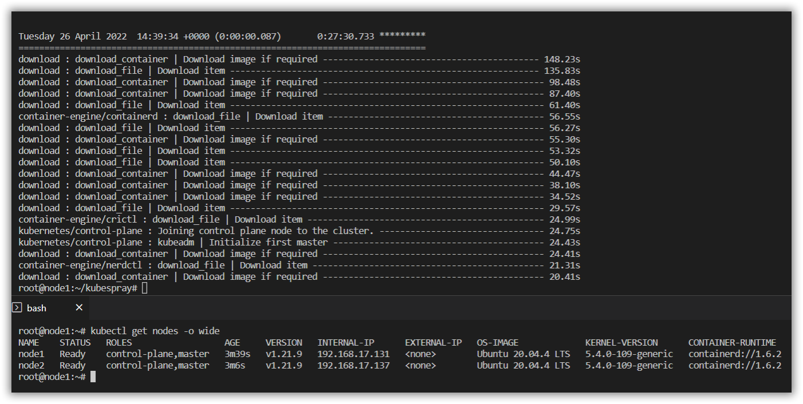
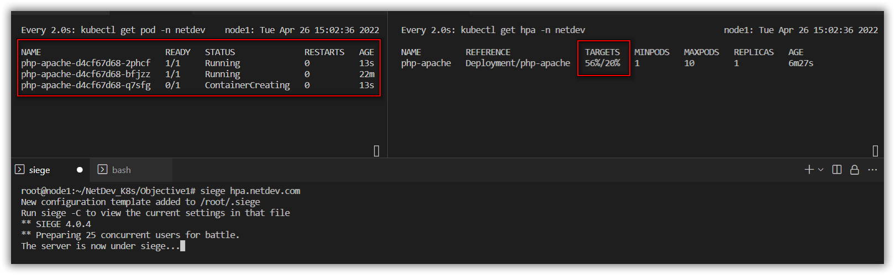
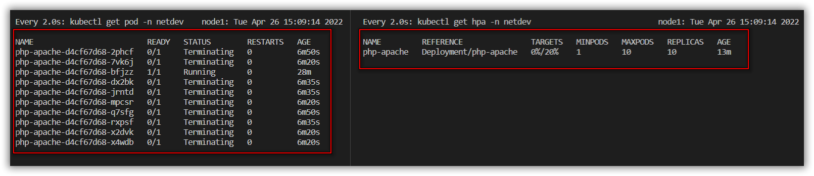
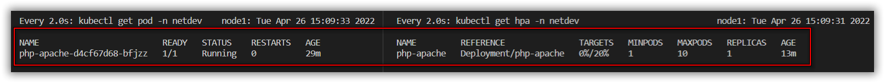

# Objective 1

## Environment
```
Kubernetes Cluster v1.21.9 from KubeSpray Hosted on Ubuntu Server 20.04LTS on VMWare Workstation Pro.
```

## Task
```
1. Install Kubernetes menggunakan Kubeadm/Kubespray di 2VM (1 Master dan 1 Worker) => Boleh virtualBox/Proxmox/VMware ataupun public cloud seperti GCP/AWS/Azure.
2. Buat deployment aplikasi bebas, boleh nginx/apache/dsb.
3. Buat service berbentuk cluster IP dan Ingress menggunakan Nginx Ingress.
4. Buat Horizontal Pod Auto Scaller pada deployment yang ada.
5. Lakukan test load ke endpoint ingress aplikasi, bisa menggunakan siege/dsb.
6. Pantau perubahan banyaknya pod saat di berikkan load.
7. Pantau perubahan banyaknya pod saat load dihentikan.
8. Simpulkan dan jelaskan apa yang terjadi.
```

## 1. Kubernetes Cluster Provision with Kube Spray
```
https://gist.github.com/gilangvperdana/886bc80cefdcd1be7ea356e41fa2871d
```


## 2. Deployment some Apps
```
kubectl create ns netdev
kubectl apply -f 2.\ phpapache-depl.yaml -n netdev
```

## 3. Deployment Service Cluster IP & Ingress
- For Cluster IP
```
kubectl apply -f 3.\ phpapache-svc.yaml -n netdev
```

- For Ingress
- Deploy MetaLLB first for Nginx Ingress Purposes
```
kubectl apply -f https://raw.githubusercontent.com/metallb/metallb/v0.11.0/manifests/namespace.yaml
kubectl apply -f https://raw.githubusercontent.com/metallb/metallb/v0.11.0/manifests/metallb.yaml
kubectl apply -f 3.\ metallb-confmap.yaml -n metallb-system
```
- Deploy Nginx Ingress with Helm
    
```
curl -fsSL -o get_helm.sh https://raw.githubusercontent.com/helm/helm/main/scripts/get-helm-3
chmod 700 get_helm.sh
./get_helm.sh

helm repo add ingress-nginx https://kubernetes.github.io/ingress-nginx
kubectl create ns ingress-nginx
helm install myingress ingress-nginx/ingress-nginx -n ingress-nginx
```
- Deploy rule path Ingress on http://hpa.netdev.com
    
```
kubectl apply -f 3.\ phpapache-ing.yaml -n netdev
```

## 4. Turn on HPA for php-apache deployment
```
kubectl apply -f https://github.com/kubernetes-sigs/metrics-server/releases/latest/download/components.yaml
kubectl patch deployment metrics-server -n kube-system --type 'json' -p '[{"op": "add", "path": "/spec/template/spec/containers/0/args/-", "value": "--kubelet-insecure-tls"}]'

kubectl autoscale deployment php-apache --cpu-percent=20 --min=1 --max=10 -n netdev
kubectl get hpa -n netdev
```

## 5. Test load with Siege
- Make sure you was declare hpa.netdev.com on /etc/hosts:
```
kubectl get all -n igress-nginx
nano /etc/hosts

---
{ip_external_nginx_ingress} hpa.netdev.com
---
```

- Test with Siege to hpa.netdev.com
```
apt install -y siege
siege hpa.netdev.com
```

## 6. POD on High Load
```
Keep RUN your Siege and,
Pod will be increase to some BIG number of replicas.
```


## 7. POD on Low Load
```
Stop your Siege and,
POD will be decrease to some SMALL number of replicas.
Usually will be Scale Replicas down 300second from reduced requests.
```



## 8. Conclusion
Kubernetes dapat mensupport bisnis ke model yang sangat fleksibel, karena kekuatan replikasi yang menyebabkan High Availability dari setiap paradigma nya (disini auto scale pada POD).
