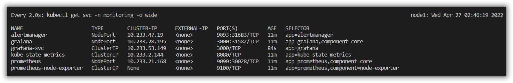
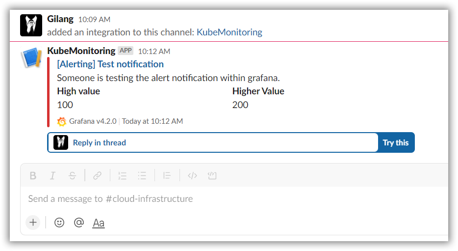

# Objective 4

## Environment
```
Kubernetes Cluster v1.21.9 from KubeSpray Hosted on Ubuntu Server 20.04LTS on VMWare Workstation Pro.
```

## Task
```
1. Install Kubernetes menggunakan Kubeadm/Kubespray di 2VM (1 Master dan 1 Worker) => Boleh virtualBox/Proxmox/VMware ataupun public cloud seperti GCP/AWS/Azure.
2. Buat deployment aplikasi monitoring, Prometheus & Grafana.
3. Buat service berbentuk cluster IP (Prometheus & Grafana) dan Ingress menggunakan Nginx Ingress untuk aplikasi monitoring (Grafana).
4. Buka dashboard grafana lewat endpoint ingress dan monitor kubernetes Cluster dari Grafana.
5. Buat alerting ke Slack dari Grafana
6. Coba buat deployment baru (bebas, bisa nginx/apache/dll) untuk men-trigger alerting ke slack
```

## 1. Kubernetes Cluster Provision with Kube Spray
```
https://gist.github.com/gilangvperdana/886bc80cefdcd1be7ea356e41fa2871d
```


## 2. Deploy Prometheus & Grafana
```
kubectl create ns monitoring
kubectl apply -f 2.\ PrometheusGrafana.yaml -n monitoring
```
- Deployment


- Service


## 3. Expose Grafana with Cluster IP & Ingress
- Cluster IP
```
kubectl apply -f 3.\ PromGrafana-clustip.yaml -n monitoring
```


- For Ingress
- Deploy MetaLLB first for Nginx Ingress Purposes
```
kubectl apply -f https://raw.githubusercontent.com/metallb/metallb/v0.11.0/manifests/namespace.yaml
kubectl apply -f https://raw.githubusercontent.com/metallb/metallb/v0.11.0/manifests/metallb.yaml
kubectl apply -f 3.\ metallb-confmap.yaml -n metallb-system
```

- Deploy Nginx Ingress with Helm
```
curl -fsSL -o get_helm.sh https://raw.githubusercontent.com/helm/helm/main/scripts/get-helm-3
chmod 700 get_helm.sh
./get_helm.sh

helm repo add ingress-nginx https://kubernetes.github.io/ingress-nginx
kubectl create ns ingress-nginx
helm install myingress ingress-nginx/ingress-nginx -n ingress-nginx
```

- Deploy Rule Path Grafana Ingress
```
kubectl apply -f 3.\ PromGrafana-ing.yaml -n monitoring
```


## 4. Open Grafana Dashboard with Ingress Endpoint
- Dont forget to declare `IP_EXTERNAL_NGINX` with `grafana.netdev.com` on `/etc/hosts` if on `Linux` OR on `hosts` is on `Windows`


## 5. Make an automation alerting to Slack from Grafana
- Access grafana from Ingress `grafana.netdev.com` 
- Goes to `Alerting` > `Configure Notification` > `New Channel`
- Fill Name for free and select `type` to `Slack`
- Goes to `https://api.slack.com/apps/new` > `Create App` > `From Scrath` > Fill Name on `App Name` > Select your `Workspace` 

- Invite to Workspace. Turn On `Incoming WebHooks` > `Add New Webhook to Workspace`

- Copy WebHook URL

- Paste URL on Grafana Slack Settings

- Send Test & Save from Grafana and See on Slack Channels

- Finnish Integrate Grafana with Slack

## 6. Triger Allerting with make a new Deployment
- Import Dashboard with code `8685`


- Monitor Graph Cluster Disk Capacity (for Example)


- Edit, goes to `Alert` then configure threshold,etc


- Try to deploy some deployment, then delete (to Trigger disk space and then alerting will send to Slack)
